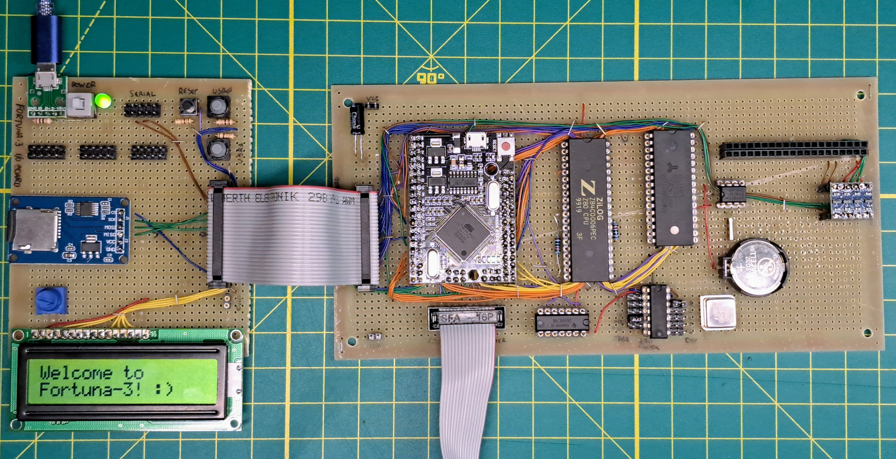

# Fortuna-3
A homemade Z80 computer.



The computer contains:

 - A Z80 microprocessor running at 6 Mhz.
 - 512 kB of RAM (divided in banks of 64 kB)
 - A main control unit (ATMEGA 2560) that provides:
   - ROM startup code
   - Serial interface (UART)
   - Interface to a real time clock (DS1602)
   - Interface to a SD Card + FAT support
   - Interface to 3 generic SPI interfaces
   - Memory operations (such as bank switching and memcpy)
   - Floating point and advanced integer operations, other math functions
   - String utilities, formatting
   - Access to EEPROM memory
   - A monitor program for managing memory and interfaces
 - A Raspberry PI W Zero that provides:
   - Video output (text, 2d output with sprites, 3d support)
   - Audio output
   - Wi-Fi and TCP/IP stack, plus support for common protocols

## MCU (main control unit)

### Registers

Registers can be read/set with `IN` and OUT `Z80` instructions.

| I/O address | Register | Pourpose |
|-------------|----------|----------|

### OUT operations

| I/O address | Operation name | Pourpose | Data byte |
|-------------|----------------|----------|-----------|
| `0x0`       | `SER_OUT`      | Send a character to the serial port | The character to print |

### IN operations

| I/O address | Operation name | Pourpose | Data byte |
|-------------|----------------|----------|-----------|
| `0x0`       | `SER_IN_SYNC`  | Read a character to the serial port, blocking | The character read |
| `0x1`       | `SER_IN_ASYNC` | Read a character to the serial port, non blocking | The character read, or `0x0` if nothing was read |


## Emulator / Debugger

To build the emulator / debugger (make sure you have emcc, npm and a JDK-v17 installed):

```
cd debugger
./build.sh
```
